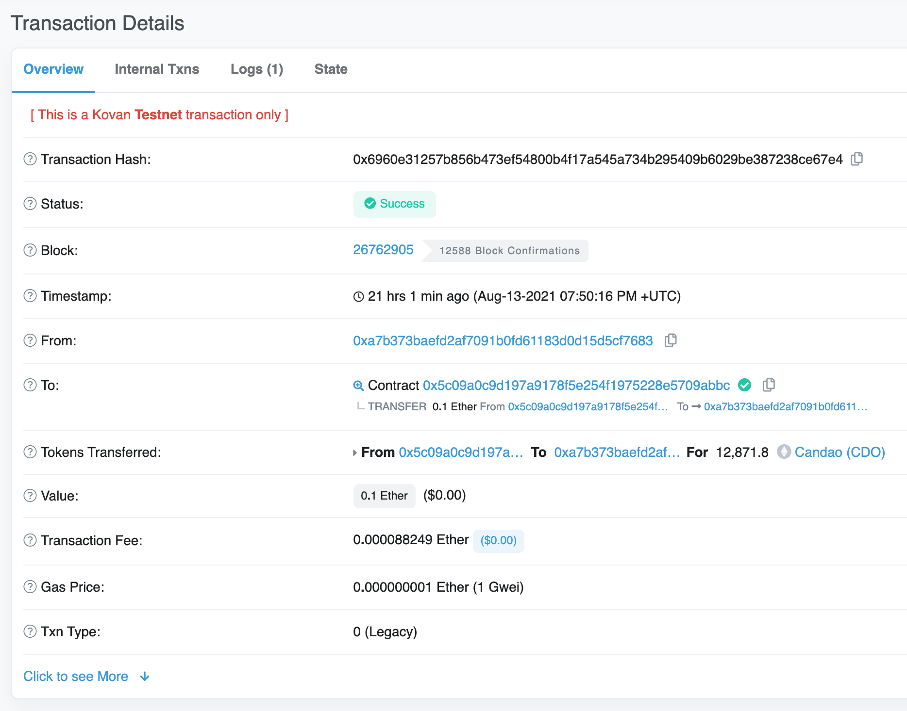

# User's Manual

> Attention! Some screenshots may contain addresses other than those actually used on the main network.  
> Please, use the addresses provided in the body of this document or in the README file.

### Table of contents

* [Which wallets you can use to buy tokens](#which-wallets-you-can-use-to-buy-tokens)
* [Creating a wallet](#creating-a-wallet)
* [Accessing your wallet](#accessing-your-wallet)
* [Buying ethereum](#buying-ethereum)
* [Buying tokens](#buying-tokens)
* [Managin tokens](#managing-tokens)

## Which wallets you can use to buy tokens
Tokens can be bought from wallets that support the standard ERC20.
The most common wallets are:
* MyEtherWallet
* Ethereum Wallet / Mist
* Parity

Do not buy tokens directly from stock exchanges or exchangers!

## Creating a wallet
To participate in the sale you will need an ethereum wallet supporting ERC20.
If you do not already have one, we recommend using [MyEtherWallet](https://www.myetherwallet.com).

1. Go to [myetherwallet.com](https://www.myetherwallet.com). Click `Create New Wallet` button.
    

Click to see screenshot

    

    
 

2. Select the way you want to access your wallet. Using MEW wallet app is a recommended method.
However, we will select `By Keystore File` as it does not require any additional software.
Сreate a password that you will use to access your wallet.
    

Click to see screenshot

    

    
 

3. Download your Keystore file & save this file to a USB drive.  
    

Click to see screenshot

    

    
 
  
## Accessing your wallet

1. Click `Access My Wallet` button at [myetherwallet.com](https://www.myetherwallet.com).

2. Select `Software`.
    

Click to see screenshot

    

    
 

6. Select `Keystore file` and click `Continue`. System window will appear. Select the `Keystore file` downloaded in the [previous](#creating-a-wallet) section.
    

Click to see screenshot

    

    
 

7. Enter your password
    

Click to see screenshot

    

    
 

## Buying ethereum
To participate in the sale you will need an Ether (ETH).
You can purchase ETH using Visa or MasterCard bank cards through such services as:
* [Changelly.com](https://changelly.com)
* [Cex.io](https://cex.io)
* [Coinbase.com](https://www.coinbase.com)

During the purchase you will need the wallet address created in the previous section.
All services have different commissions and different rates.
Make sure the exchange rate suits you.

## Buying tokens
In order to buy tokens you need to send at least 0.03 ETH to the current crowdsale contract address: [wip](https://etherscan.io/address/#readContract)

Before sending, make sure that:
1. You send at least 0.03 ETH (depending upon the configuration of the sales contract, this value may differ. See `minInvestedLimit` of the corresponding sales stage [here](https://etherscan.io/address/#readContract)).
2. The amount of `gas` is greater than 250 000.
3. `Gas price` — at least 30 Gwei. Transactions with less gas price will take longer. Gas price may change over time. See detailed information about gas price [here](https://etherscan.io/gastracker).

If you are using MyEtherWallet, you need to do the following:
1. Go to [myetherwallet.com](https://www.myetherwallet.com)

2. Click `Send Transaction`. Select `amount` to send and sale contract [address](https://etherscan.io/address/). You can leave the `gas price` as is or specify your own.
    

Click to see screenshot

    

    
 

3. In the `Advanced` section set `Gas Limit` to 250 000. Click `Send Transaction`.
    

Click to see screenshot

    

    
 

4. In the window that opens check again the `amount` to send, `address`, `gas limit` and `gas price`. Click `Confirm and send`.
    

Click to see screenshot

    

    
 

5. Click `Check Status on Etherscan.io`, to see transaction details
    

Click to see screenshot

    

    
 

## Managing tokens
To add tokens to your wallet, you need the following information:
* Token Contract Address - **[wip](https://etherscan.io/token/)**
* Token Symbol — **CDO**
* Decimals — **18**
1. Open your MetaMask wallet, navigate to "Assets" tab and click "Add Token" button.
    

Click to see screenshot

    

    
 

2. Fill in the field `Token Contract Address`. Metamask will fill in the `Token Symbol` and the `Token Decimals` for you.
    

Click to see screenshot

   

    
 

3. Click `Add Tokens` on the next screen.
    

Click to see screenshot

   

    
 

4. You can now monitor your CDO balance and transfer token directly from MetaMask.
    

Click to see screenshot

   

    
 
